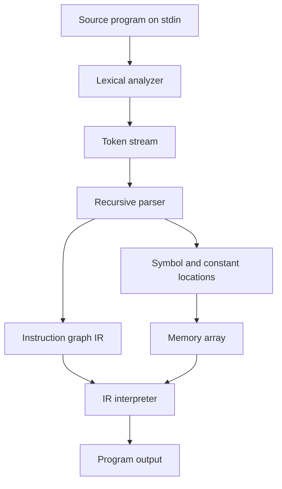

# CSE 340 Parser and Intermediate-Representation Interpreter

A C++ compiler front end for a small imperative language. The program reads source code from standard input, tokenizes and parses it, lowers each statement into a pointer-linked intermediate representation (IR), and executes that IR with a provided interpreter.

This project demonstrates how high-level constructs such as assignments, conditionals, and loops can be represented using a compact set of low-level instructions: `ASSIGN`, `IN`, `OUT`, `CJMP`, `JMP`, and `NOOP`.

## Project status

| Feature | Status |
| --- | --- |
| Variable declarations and integer constants | Supported |
| Assignment and integer arithmetic | Supported |
| Standard input and output statements | Supported |
| `IF` statements, including nesting | Supported |
| `WHILE` loops, including nesting | Supported |
| `FOR` loops | Supported by the included examples |
| `SWITCH` / `CASE` / `DEFAULT` | Incomplete |
| Syntax-error reporting | Not implemented; input is assumed to be valid |

The implementation passes all **33 bundled golden-output tests** for assignments, input/output, nested conditionals, and loops. The three additional `FOR` examples also execute as expected. The current `SWITCH` implementation is unfinished and should not be considered production-ready.

## How it works



### 1. Lexical analysis

`lexer.cc` reads the full input and converts identifiers, numbers, keywords, operators, and punctuation into `Token` objects. The parser consumes these tokens through `GetToken()` and uses `peek()` for lookahead.

### 2. Memory and symbol mapping

`parse.cc` maintains a map from each variable or integer literal to an index in the global `mem[1000]` array.

- Declared variables receive unique slots initialized to `0`.
- Integer literals are stored in their own slots during parsing.
- IR instructions store memory indices rather than variable names or immediate values.

For example, an assignment such as `total = total + 1;` becomes an `ASSIGN` node containing the memory indices for `total` and the constant `1`, plus the addition operator.

### 3. Intermediate-representation generation

The parser builds a linked graph of `InstructionNode` objects. Sequential statements use each node's `next` pointer; control-flow instructions can also point to jump targets.

| IR instruction | Purpose |
| --- | --- |
| `ASSIGN` | Copies a value or applies `+`, `-`, `*`, or integer `/` |
| `IN` | Copies the next value from the input vector into a variable |
| `OUT` | Prints a variable's current value |
| `CJMP` | Continues when a condition is true; jumps to `target` when false |
| `JMP` | Unconditionally transfers execution to `target` |
| `NOOP` | Marks a control-flow join or exit point |

Control structures are lowered as follows:

- **`IF`**: a `CJMP` points past the body to a trailing `NOOP` when the condition is false.
- **`WHILE`**: a `CJMP` guards the body, a trailing `JMP` returns to the condition, and a `NOOP` marks the loop exit.
- **`FOR`**: the parser emits initialization, condition, body, update, backward jump, and exit nodes in execution order.

### 4. Execution

`execute_program()` in `compiler.cc` acts as a small virtual machine. It uses a program-counter pointer to traverse the instruction graph, performs arithmetic through the shared memory array, and follows conditional or unconditional jump targets.

## Supported source-language syntax

The input contains three sections:

1. A comma-separated variable declaration ending in `;`
2. A program body enclosed in `{ ... }`
3. Zero or more integer input values after the body

Example:

```text
a, b, i;
{
    input a;
    b = 0;

    FOR (i = 0; i < a; i = i + 1;)
    {
        b = b + i;
    }

    output b;
}
5
```

Important language rules:

- Variables are integers and default to `0`.
- `input` and `output` are lowercase; control-flow keywords are uppercase.
- Arithmetic expressions contain either one primary value or two primary values with one operator.
- Conditions support `>`, `<`, and `<>` (not equal).
- Division uses integer arithmetic.
- `IF` has no `else` branch.

## Build and run

### Requirements

- A C++17-compatible compiler such as GCC or Clang
- A Unix-like shell for the supplied test script

### Compile

```bash
g++ -std=c++17 compiler.cc lexer.cc inputbuf.cc parse.cc -o parser
```

### Run a program

The executable reads the source program and its runtime inputs from standard input:

```bash
./parser < tests/test_control_while3_fibonacci.txt
```

Expected output:

```text
1 1 2 3 5 8 13 21 34
```

You can also run an arbitrary source file:

```bash
./parser < path/to/program.txt
```

## Testing

Compile the project first, then compare an individual result with its expected output:

```bash
./parser < tests/test_assignment_basic1.txt \
  | diff -Bw - tests/test_assignment_basic1.txt.expected
```

No output from `diff` means the test passed.

The repository also contains `test_p3.sh`, which expects the executable to be named `a.out`:

```bash
g++ -std=c++17 compiler.cc lexer.cc inputbuf.cc parse.cc -o a.out
chmod +x test_p3.sh
./test_p3.sh
```

Only tests with matching `.expected` files are suitable for automated golden-output comparison.

## Repository structure

| Path | Role |
| --- | --- |
| `parse.cc` | Parser, symbol/constant mapping, and IR construction |
| `lexer.cc`, `lexer.h` | Tokenization and token-stream lookahead |
| `inputbuf.cc`, `inputbuf.h` | Character-level buffered input |
| `compiler.h` | IR instruction types, shared memory, and parser interface |
| `compiler.cc` | IR interpreter and executable entry point |
| `demo.cc` | Hard-coded example of the expected instruction graph |
| `tests/` | Source programs and expected outputs |
| `test_p3.sh` | Shell-based golden-output test runner |
| `CSE340F23_Project3.pdf` | Original course project specification |

## Technical concepts demonstrated

- Handwritten parsing with token lookahead
- Symbol-table construction with `std::map`
- Pointer-based linked structures and explicit control-flow graphs
- Intermediate-representation design
- Lowering structured control flow into jumps
- Structs, unions, enums, dynamic allocation, and recursion in C++
- Golden-output testing from the command line

## Known limitations

- `SWITCH` parsing and IR generation are incomplete.
- The parser assumes syntactically and semantically valid input and does not produce user-facing diagnostics.
- IR nodes are dynamically allocated and not explicitly freed before process exit.
- Runtime storage is a fixed-size array of 1,000 integers.
- Division by zero, input exhaustion, and memory-capacity overflow are not checked.
- The included prebuilt `a.out` is a macOS ARM64 binary; compiling from source is recommended on every platform.

## Course context and attribution

This repository was created for Arizona State University's CSE 340 compiler project. The course supplied the lexer/input-buffer infrastructure, IR definitions, interpreter, and project specification. The primary project work is the parser and intermediate-representation generation in `parse.cc`.
